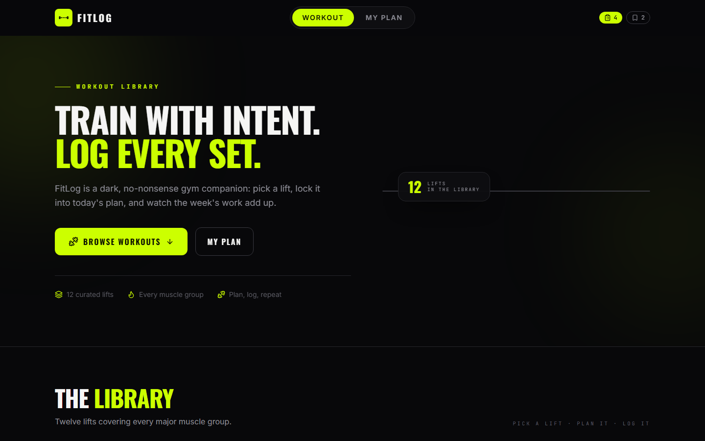
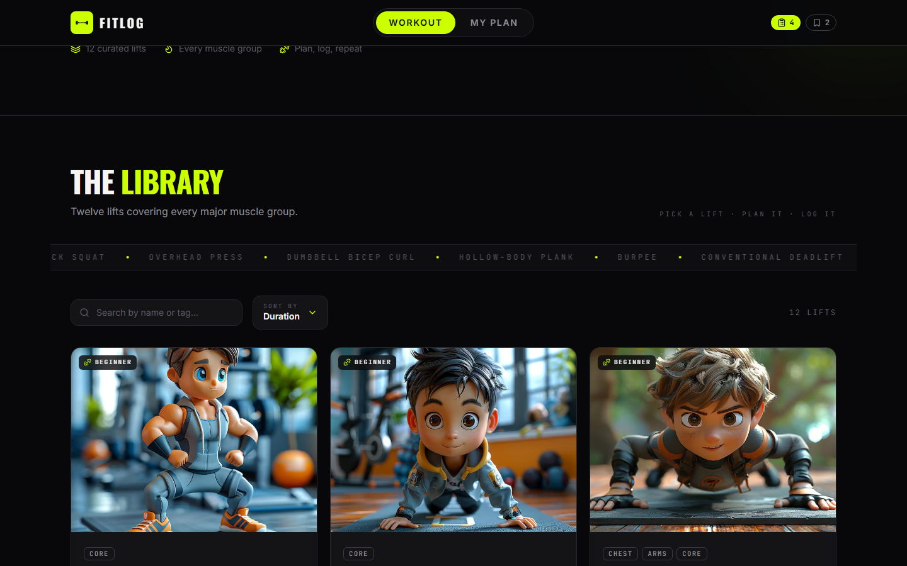
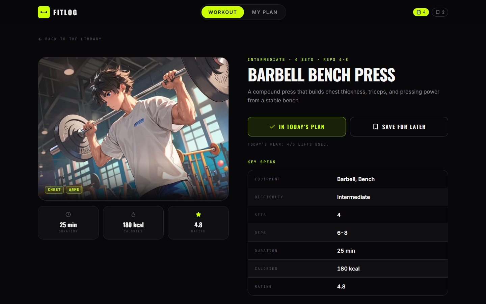
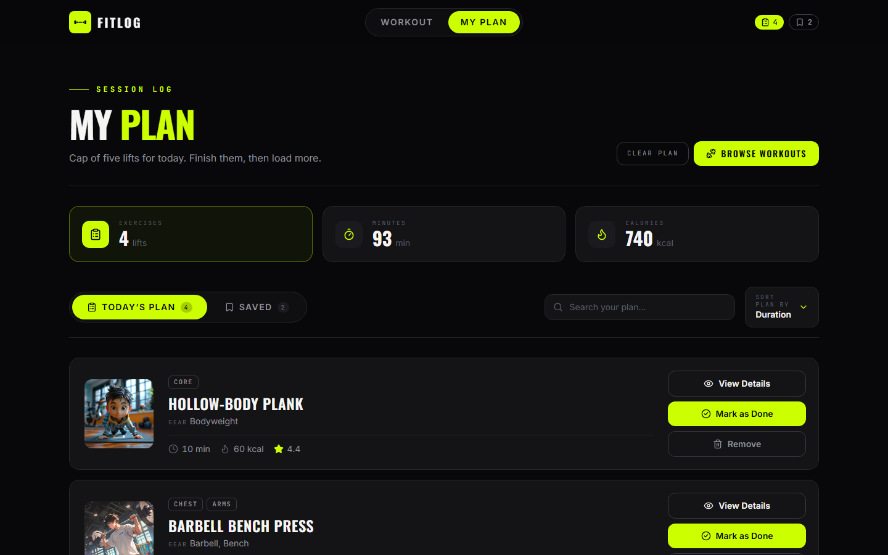
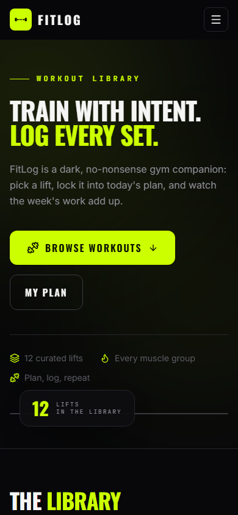
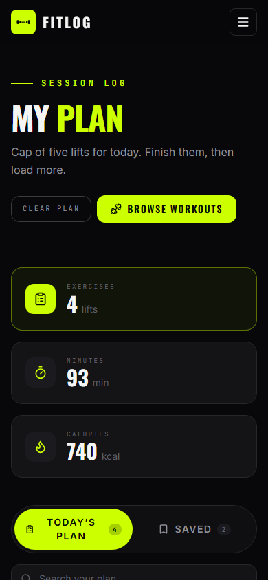

# FitLog — Workout Library

**Train with intent. Log every set.**

FitLog is a dark, no-nonsense gym companion. Browse a curated library of twelve lifts covering
every major muscle group, open a lift to see its full spec sheet and step-by-step instructions,
then lock it into **today's plan** — capped at five lifts so you actually finish the session.

Built with the Next.js App Router, Tailwind CSS v4 and TypeScript, with every piece of state
(plan, saved, completed lifts) persisted in `localStorage`.

---

## Screenshots

| Home | Library |
| --- | --- |
|  |  |

| Workout detail | My Plan |
| --- | --- |
|  |  |

| Mobile | Mobile plan |
| --- | --- |
|  |  |

---

## Description

A single-page-style workout library built on top of a public FitLog REST API.

- The **library** renders all twelve lifts in a responsive 3×4 grid, each card showing an
  illustration, muscle-group tags, equipment, and duration / calories / rating.
- Each **detail page** (`/workouts/[id]`) is a two-column layout: a large visual on the left, and
  on the right the title, description, tags, a full key-specs table, numbered instructions, and the
  two calls to action.
- **My Plan** (`/my-plan`) is the log page: live session metrics (exercises / minutes / calories),
  Today's Plan and Saved tabs, a "mark as done" toggle, one-tap removal, and a proper empty state.
- All data is fetched through a same-origin route handler that talks to the upstream API, so the UI
  never breaks when the third-party host rate-limits or goes down.

---

## Technologies used

| Technology | Purpose |
| --- | --- |
| **Next.js 16 (App Router)** | UI, routing, server components, streaming, ISR |
| **React 19** | Components and client state |
| **TypeScript** | End-to-end type safety for API payloads |
| **Tailwind CSS v4** | Dark design system, responsive layouts |
| **lucide-react** | Icon set for stats, actions and states |
| **next/font** | Self-hosted Oswald (display) + Inter (body) + JetBrains Mono |
| **localStorage** | Plan / saved / done persistence across reloads |
| **ESLint 9** | Linting (`eslint-config-next`) |

---

## Features

1. **Workout library grid** — all twelve API lifts in a responsive 1 / 2 / 3-column grid with
   illustration, category pills, equipment line and a duration / calories / rating stat row.
2. **Workout detail pages** — two-column layout with a large visual, full key-specs table
   (equipment, difficulty, sets, reps, duration, calories, rating) and numbered instructions.
3. **Today's Plan with a five-lift cap** — add lifts from any detail page; the CTA disables itself
   and explains itself once the cap is reached.
4. **Saved for later** — a second collection with its own tab and a live badge counter in the navbar.
5. **Live session metrics** — exercises, minutes and calories totals update the moment a lift is
   added or removed.
6. **Mark as Done** — tick a planned lift off, with a toast confirmation and a strikethrough state.
7. **Sort By dropdown** — re-sort the current list by Duration, Calories or Rating.
8. **Search** — filter the library, the plan and saved lifts by name, muscle-group tag or equipment.
9. **Toast notifications** — every add / save / done / remove action is confirmed with a toast.
10. **localStorage persistence** — plan, saved and completed lifts survive a full page reload.
11. **Resilient data layer** — two API mirrors, a one-hour cache, typed normalisation, and a branded
    fallback illustration if a remote image fails to load.
12. **Loading + error states** — skeleton grid on the home page, "Loading workouts…" on My Plan, a
    retry panel on failure, and a custom 404 page for unknown routes.

---

## Getting started

```bash
# install dependencies
npm install

# run the dev server (http://localhost:3000)
npm run dev

# production build
npm run build && npm start

# lint
npm run lint
```

---

## Project structure

```
src/
├── app/
│   ├── api/workouts/route.ts     # same-origin proxy + cache in front of the API
│   ├── workouts/[id]/page.tsx    # detail page (dynamic, streamed "more lifts")
│   ├── my-plan/page.tsx          # the log page
│   ├── not-found.tsx             # 404
│   ├── error.tsx                 # route error boundary
│   ├── layout.tsx                # fonts, metadata, providers, navbar, footer
│   └── page.tsx                  # home: hero + library
├── components/
│   ├── detail/                   # spec table, instructions, CTAs, related lifts
│   ├── home/                     # hero banner
│   ├── layout/                   # navbar, footer
│   ├── library/                  # card grid, search + sort browser
│   ├── plan/                     # my-plan view, plan cards
│   ├── providers/                # plan store + toast system
│   └── ui/                       # logo, image, stats, tags, sort, search, loading
└── lib/
    ├── api.ts                    # fetch helpers, mirrors, sort/filter
    ├── useWorkouts.ts            # client data hook with loading state
    ├── storage.ts                # guarded localStorage
    ├── format.ts                 # display helpers
    └── types.ts                  # shared types
```

---

## Data source

The app reads from the public FitLog API, with automatic failover between two mirrors:

```
GET https://api.api-store.workers.dev/api/fitlog      # primary
GET https://api.abcz.workers.dev/api/fitlog          # fallback
GET https://api.api-store.workers.dev/api/fitlog/:id
```

Requests are made server-side through `src/lib/api.ts` (cached for one hour) and exposed to the
browser via `GET /api/workouts`.

---

## Accessibility & responsiveness

- Semantic landmarks, a skip link, labelled tabs (`role="tablist"`), and `aria-live` regions for
  result counts, toasts and the plan-cap message.
- Verified with no horizontal overflow at 320px, 390px, 820px and 1440px.
- `prefers-reduced-motion` disables the marquee, toasts and smooth scrolling.

## License

MIT
